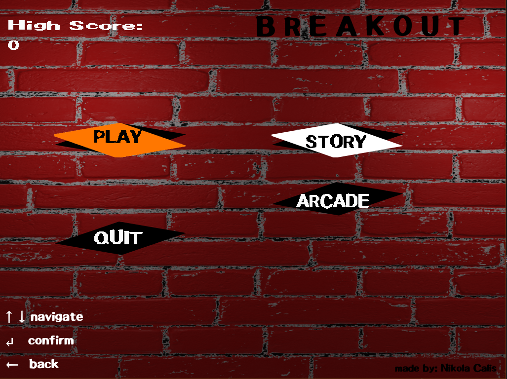

# Breakout
My implementation of an arcade game Breakout.

## Prerequirements
- **SDL**
  - SDL is used for texturing, drawing text and shapes, playing soundtracks and sound effects
  - [Setup guide for Visual Studio] https://stackoverflow.com/questions/57732058/how-do-i-link-sdl-with-visual-studio-2019
  - [NOTE] SDL_image, SDL_ttf and SDL_mixer are also required when installing
- **TinyXML**
  - TinyXML is used for parsing XML files and their loading and saving
  - [Setup guide for VS] This library is already included in this project as a header and a cpp file

## Game
- **Game modes**
  - [STORY] Play a short story about a main character (yourself).
  - [ARCADE] Play procedurally generated levels until you run out of lives.
  
- **Gameplay**
  - Use left/right arrow keys to move the paddle. The longer you hold the key, the more faster the paddle will go.
  - Aim the ball to fall onto paddles left/right edges (marked with orange) to bounce the ball in the edge direction.
  - Maintain high velocity to bounce the ball off in the velocity direction.
  
  - Press Esc key at any time during the level to pause the game.
  
  - Finish main story to gain a new Main Menu background.
  
  - Destroy the bricks to beat the high score.
  - High score is updated upon a successfully finished level.

## Soundtracks and sound effects
- **Soundtracks**
  - Special thanks to Bensound for letting me use their soundtracks. Every soundtrack can be found here: https://www.bensound.com/
- **Special effects**
  - Special thanks to ZapSplat for letting me use their sound effects. Every sound effect can be found here: https://www.zapsplat.com/

## Textures
- Every texture (background image) is made by me using blender 3d.

## Fonts
- Special thanks to HattyMikune (https://www.youtube.com/c/HattyMikune/) and ToxicDevil (https://www.youtube.com/user/ToxicDevil93) for letting me use their font.

## Release
- Download executable file from here:  (Windows only) 
